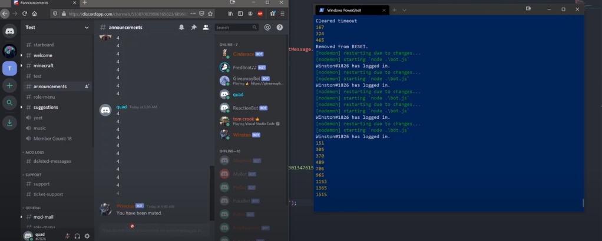

# ANTISPAM NO DISCORD
🤖ESTE É UM BOT DO DISCORD FEITO COM DISCORDJS. ELE MONITORA MENSAGENS ENVIADAS POR USUÁRIOS E IMPÕE LIMITES PARA EVITAR SPAM.

 <br>

## DESCRIÇÃO:
Este bot monitora mensagens enviadas por usuários e impõe limites para evitar spam. Ele utiliza um `Map` para rastrear o número de mensagens enviadas por cada usuário e aplicar ações como mute temporário se um limite pré-definido for atingido em um intervalo de tempo específico.

## FUNCIONALIDADES:
1. **Controle de Spam**:
   - O bot mantém um registro de mensagens enviadas por cada usuário usando um `Map` chamado `usersMap`.
   - Define um limite (`LIMIT`) de mensagens que um usuário pode enviar dentro de um intervalo de tempo (`TIME`).
   - Se o usuário enviar mensagens rapidamente demais (`DIFF`), o contador de mensagens é reiniciado.
   - Se um usuário atingir o limite de mensagens, ele recebe um cargo de mute temporário e uma mensagem de notificação é enviada no canal.

2. **Interação com o Discord**:
   - O bot utiliza o módulo `discord.js` para interagir com a API do Discord.
   - Ele se conecta ao Discord usando o token fornecido em um arquivo `.env` (`process.env.BOT_TOKEN`).
   - O evento `message` é usado para monitorar todas as mensagens enviadas no servidor Discord.

## EXECUTANDO O PROJETO:
1. **Editar o código:**
   - Certifique-se de substituir `seu_token_aqui` pelas informações corretas das suas credenciais em `CODIGO/.env`.

2. **Instalando as Depêndencias:**
   - Para instalar as dependências listadas no arquivo "package.json", você pode usar o comando `npm install` no terminal. Certifique-se de estar no diretório do seu projeto onde o arquivo "package.json" está localizado (`CODIGO`). O npm irá ler o arquivo "package.json" e instalar todas as dependências listadas nele. 

   ```bash
   npm install
   ```

3. **Inicie o Bot:**
   - Execute o bot do Telegram iniciando-o com o seguinte comando:
    ```bash
    npm start
    ```

4. **Uso no Discord**:
   - Adicione o bot ao seu servidor Discord e conceda as permissões necessárias.
   - O bot monitorará todas as mensagens e aplicará as ações de acordo com as regras configuradas.
  
## NÃO SABE?
- Entendemos que para manipular arquivos em muitas linguagens e tecnologias relacionadas, é necessário possuir conhecimento nessas áreas. Para auxiliar nesse aprendizado, oferecemos cursos gratuitos disponíveis:
* [CURSO DE DISCORDJS](https://github.com/VILHALVA/CURSO-DE-DISCORDJS)
* [CURSO DE JAVASCRIPT](https://github.com/VILHALVA/CURSO-DE-JAVASCRIPT)
* [CURSO DE NODEJS](https://github.com/VILHALVA/CURSO-DE-NODEJS)
* [CONFIRA MAIS CURSOS](https://github.com/VILHALVA?tab=repositories&q=+topic:CURSO)

## CREDITOS:
- [PROJETO CRIADO PELO "stuyy"](https://github.com/stuyy/discordjs-youtube-tutorials/tree/master/anti-spam)
- [VEJA O VIDEO DESSE PROJETO](https://youtu.be/xzMiszeTEiI?si=NiLsXz7j13bqMJEU)
- [PROJETO FEITO PELO VILHALVA](https://github.com/VILHALVA)

